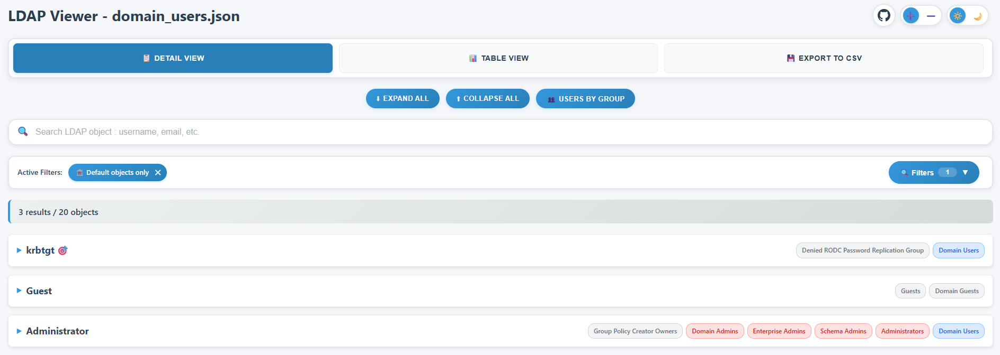
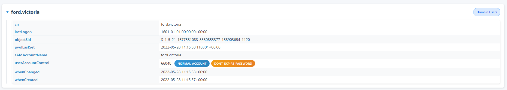
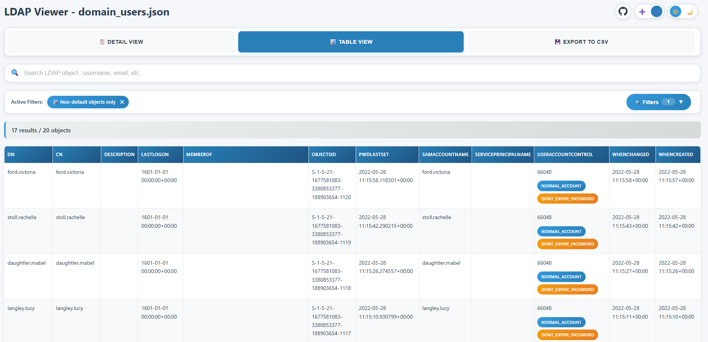
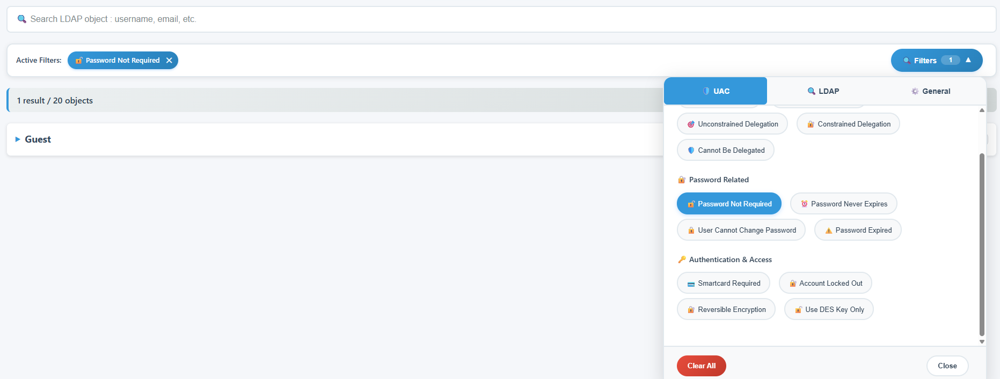
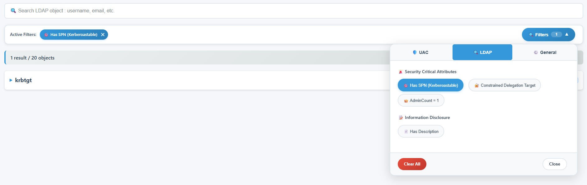

# ldapviewer

[![Contributors][contributors-shield]][contributors-url]
[![Forks][forks-shield]][forks-url]
[![Stargazers][stars-shield]][stars-url]
[![Issues][issues-shield]][issues-url]
[![project_license][license-shield]][license-url]

**ldapviewer** is a Python script to visualize **all** LDAP data from ldapdomaindump `.json` files in a modern, interactive web interface.  
Unlike the default `.html` files generated by ldapdomaindump, **ldapviewer** displays every LDAP attribute, ensuring you never miss critical information.

<!-- TABLE OF CONTENTS -->
<details>
  <summary>Table of Contents</summary>
  <ol>
    <li><a href="#why">Why</a></li>
    <li><a href="#usage">Usage</a></li>
    <li><a href="#features">Features</a></li>
    <li><a href="#screenshots">Screenshots</a></li>
    <li><a href="#roadmap">Roadmap</a></li>
  </ol>
</details>

## Why?

I created this tool because:

1. **ldapdomaindump** and **Bloodhound** often miss some LDAP attributes in their output. For example, during several pentests, I missed sensitive data such as passwords stored in unexpected fields rather than the more common description field, because these tools didn’t display them.
2. I wanted to avoid running additional `ldapsearch` queries for information I already had, and not struggle with LDAP query syntax.
3. I needed an easy way to filter and search LDAP data for fields that are useful during penetration testing.

## Usage

```sh
python ldapviewer.py <ldapdomaindump.json>
```

### Example

To visualize a domain users dump:
```sh
python ldapviewer.py domain_users.json
```
Then open the generated HTML file (`ldapviewer_domain_users.html`) in your browser.

## Features

**ldapviewer** lets you quickly and interactively explore the full content of an LDAP JSON dump:

- **Detail view**: See all attributes for each LDAP entry, nothing is hidden.
- **Table view**: All entries and all attributes as columns, for easy comparison.
- **Instant search**: Filter entries as you type.
- **CSV export**: Export the current table view to CSV.
- **Non-default object filtering**: Instantly hide/show default Windows objects (RID < 1000).
- **UAC filtering**: Filter users by UserAccountControl flags with one click.
- **Attribute-based filtering**: Filter entries by LDAP attributes (e.g., has SPN, msDS-AllowedToDelegateTo, has Description)
- **Modern responsive interface**: All HTML/CSS/JS is embedded and works offline.
- **Dark mode**: Switch between light and dark themes with automatic system preference detection.

## Screenshots

### Main View




### Table View


### Filters





## Roadmap

See the [project roadmap](https://github.com/users/NathanielSlw/projects/2) for a full list of planned features, improvements, and known issues.


[contributors-shield]: https://img.shields.io/github/contributors/NathanielSlw/ldapviewer.svg?style=for-the-badge
[contributors-url]: https://github.com/NathanielSlw/ldapviewer/graphs/contributors
[forks-shield]: https://img.shields.io/github/forks/NathanielSlw/ldapviewer.svg?style=for-the-badge
[forks-url]: https://github.com/NathanielSlw/ldapviewer/network/members
[stars-shield]: https://img.shields.io/github/stars/NathanielSlw/ldapviewer.svg?style=for-the-badge
[stars-url]: https://github.com/NathanielSlw/ldapviewer/stargazers
[issues-shield]: https://img.shields.io/github/issues/NathanielSlw/ldapviewer.svg?style=for-the-badge
[issues-url]: https://github.com/NathanielSlw/ldapviewer/issues
[license-shield]: https://img.shields.io/github/license/NathanielSlw/ldapviewer.svg?style=for-the-badge
[license-url]: https://github.com/NathanielSlw/ldapviewer/blob/main/LICENSE
